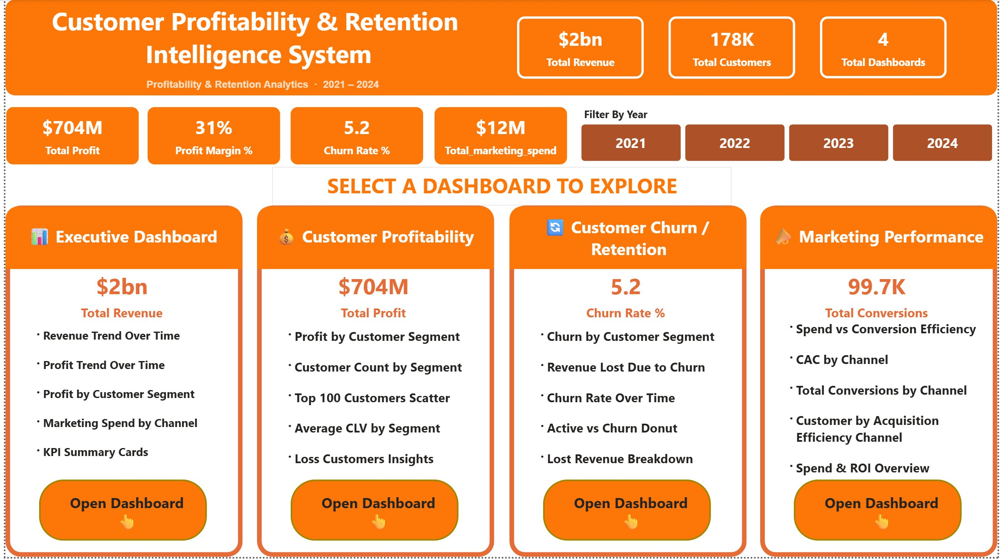
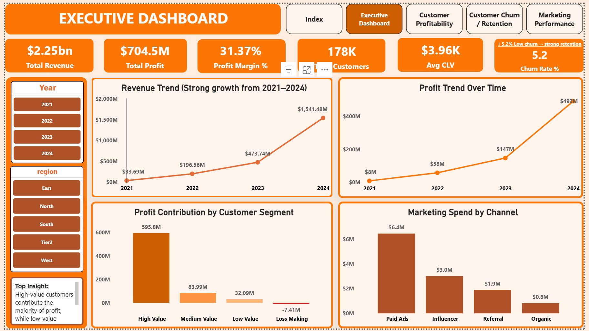
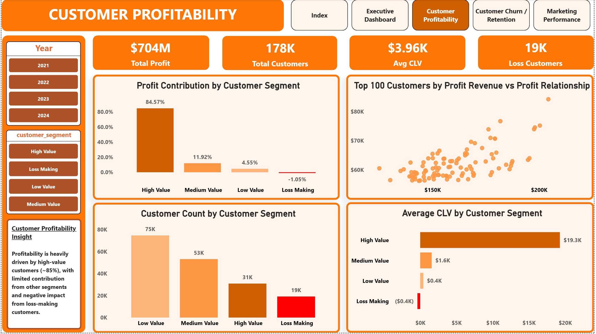
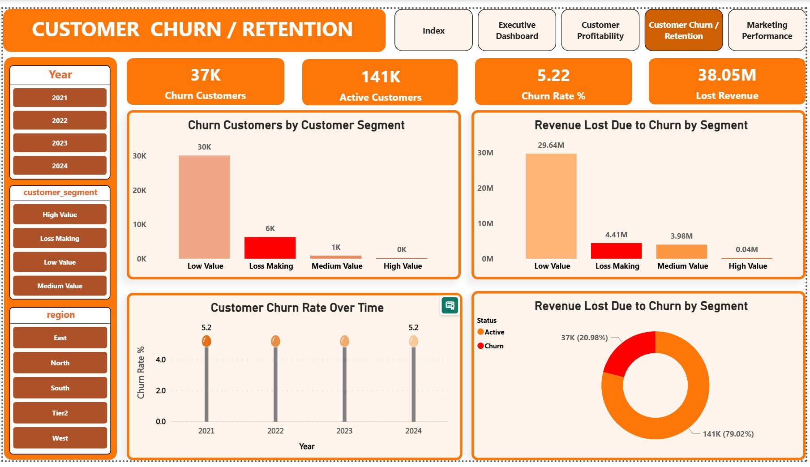
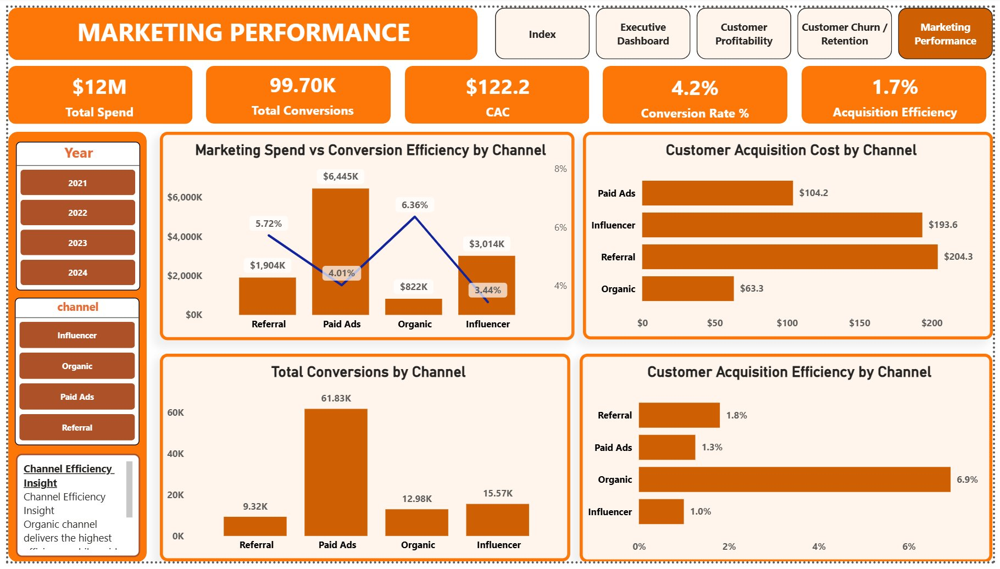

# 📊 Customer Profitability & Retention Intelligence System

> **Profitability & Retention Analytics · 2021 – 2024**  
> An end-to-end Business Intelligence project analyzing customer behavior, profitability, churn, and marketing effectiveness using SQL and Power BI.

---

## 🔗 Live Demo & Dataset

| Resource | Link |
|----------|------|
| 📊 **Live Power BI Report** | [View Dashboard](https://app.powerbi.com/groups/me/reports/e2347376-3a27-45ff-82fb-b6d93066b891/6dba9addc95883aa45dc?experience=power-bi) |
| 📁 **Dataset (Kaggle)** | [View Dataset](https://www.kaggle.com/datasets/venkatesh353/customer-profitability-and-retention-dataset) |

---

## 🗂️ Index Page



---

## 📌 Project Overview

| Detail | Info |
|--------|------|
| **Tools Used** | SQL (PostgreSQL), Power BI, DAX |
| **Dataset** | Synthetic dataset designed & generated using Claude AI |
| **Time Period** | 2021 – 2024 |
| **Dashboards** | 5 Pages (1 Index + 4 Dashboards) |
| **Total Customers** | 178K |
| **Total Revenue** | $2.25bn |
| **Total Profit** | $704M |

---

## 🎯 Objective

Analyze marketing effectiveness, identify high-value customers, and measure the financial impact of customer churn on overall business revenue.

---

## 🛠️ What I Built

- ✅ Synthetic dataset designed and generated using Claude AI
- ✅ Data extraction and transformation using SQL (views for structured datasets)
- ✅ Integrated SQL data into Power BI for reporting and analysis
- ✅ Designed a **star schema data model** with proper relationships
- ✅ 5-page Power BI report with Index landing page + 4 interactive dashboards
- ✅ Key metrics: Revenue, Profit, CAC, Conversion Rate, Churn Rate, CLV
- ✅ Dynamic filters: Year, Region, Segment, Channel

---

## 📋 Dashboards

### 1️⃣ Executive Dashboard



**Key Metrics:** $2.25bn Revenue · $704.5M Profit · 31.37% Profit Margin · 178K Customers · $3.96K Avg CLV · 5.2% Churn Rate

**Visuals:**
- Revenue Trend Over Time (Strong growth from 2021–2024)
- Profit Trend Over Time
- Profit Contribution by Customer Segment
- Marketing Spend by Channel
- KPI Summary Cards

---

### 2️⃣ Customer Profitability



**Key Metrics:** $704M Total Profit · 178K Total Customers · $3.96K Avg CLV · 19K Loss Customers

**Visuals:**
- Profit Contribution by Customer Segment
- Customer Count by Segment
- Top 100 Customers by Revenue vs Profit (Scatter)
- Average CLV by Customer Segment
- Loss Customers Insights

> 💡 **Insight:** Profitability is heavily driven by high-value customers (~85%), with limited contribution from other segments and negative impact from loss-making customers.

---

### 3️⃣ Customer Churn / Retention



**Key Metrics:** 37K Churn Customers · 141K Active Customers · 5.22% Churn Rate · $38.05M Lost Revenue

**Visuals:**
- Churn Customers by Customer Segment
- Revenue Lost Due to Churn by Segment
- Customer Churn Rate Over Time
- Active vs Churn Donut Chart
- Lost Revenue Breakdown

---

### 4️⃣ Marketing Performance



**Key Metrics:** $12M Total Spend · 99.70K Total Conversions · $122.2 CAC · 4.2% Conversion Rate · 1.7% Acquisition Efficiency

**Visuals:**
- Marketing Spend vs Conversion Efficiency by Channel
- Customer Acquisition Cost by Channel
- Total Conversions by Channel
- Customer Acquisition Efficiency by Channel
- Spend & ROI Overview

---

## 📊 Key Insights

| # | Insight |
|---|---------|
| 1 | Paid Ads generate the highest conversions but at a higher acquisition cost |
| 2 | Organic channels deliver the best efficiency with strong conversion rates |
| 3 | High-value customers (~85%) contribute the majority of total profit |
| 4 | A small segment of customers drives a significant portion of revenue loss due to churn |
| 5 | Churn rate remained stable at ~5.2% across all years (2021–2024) |

---

## 💡 Business Recommendations

1. **Optimize paid campaigns** for better cost efficiency
2. **Scale organic channels** for sustainable growth
3. **Prioritize retention strategies** for high-value customers
4. **Reassess underperforming** acquisition channels
5. **Investigate loss-making segment** to reduce revenue drag

---

## ⚠️ Note

Certain metrics like ROI and acquisition efficiency were interpreted carefully to avoid misleading conclusions due to attribution limitations in the dataset.

> 📦 Dataset is not included in this repository due to size constraints (200MB+).  
> It is publicly available on Kaggle: [Customer Profitability & Retention Dataset](https://www.kaggle.com/datasets/venkatesh353/customer-profitability-and-retention-dataset)

---

## 🔜 Next Steps

Extending this project using **Python** for:
- Customer Churn Prediction (Logistic Regression / Random Forest)
- Customer Segmentation (K-Means Clustering)

---

## 📁 Project Structure

```
├── images/
│   ├── index_page.png
│   ├── executive_dashboard.png
│   ├── customer_profitability.png
│   ├── churn_retention.png
│   └── marketing_performance.png
├── SQL_Analysis.sql
├── Customer Profitability And Retention Intelligence.pbix
├── README.md
└── Dataset → Available on Kaggle (200MB+, not hosted on GitHub)
```

---

## 👨‍💻 Author

**Venkatesh Ravva**  
B.Tech —  AI & Data Science  
Chaitanya Engineering College, Visakhapatnam

[](https://www.kaggle.com/datasets/venkatesh353/customer-profitability-and-retention-dataset)
[](https://app.powerbi.com/groups/me/reports/e2347376-3a27-45ff-82fb-b6d93066b891/6dba9addc95883aa45dc?experience=power-bi)

---

## 🏷️ Tags

`Power BI` `SQL` `DAX` `Data Analytics` `Business Intelligence` `Customer Analytics` `Churn Analysis` `Marketing Analytics` `Data Visualization` `PostgreSQL`
